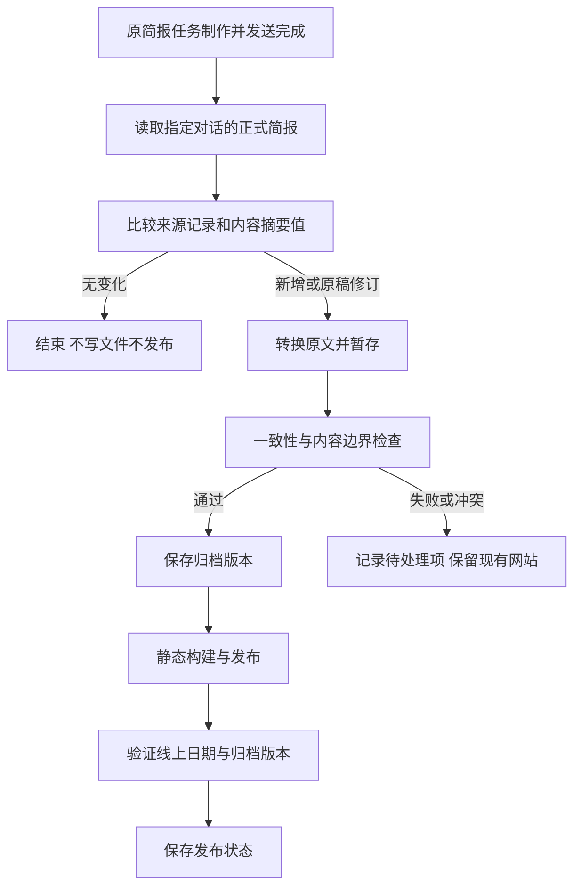

# Briefing Atlas 原简报增量归档计划书

文档日期：2026-09-08  
方案状态：方向已确定，归档流程待实施。  
核心决策：**原简报任务作为唯一内容源，网站只做增量归档。**

补充决策：**保留可以改善阅读体验的实验性功能。**“实验性”本身不是删除理由；依据实际阅读价值、依赖关系和维护成本判断，未经验证的能力如实标注。

本次交付仅新增本计划书，明确后续实施和删除清单。不执行功能删除、历史导入、任务修改、部署或 Git 提交。以下“删除”“调整”“新增”均为后续实施动作，不表示已经完成。

本文替代旧云端计划中“另建模型 API 生产线、网站正式稿反向驱动原任务”的方向。旧文件目前仍在仓库，冲突时以本文为准；实施第一阶段须按第 7 节清理，避免继续沿用旧路线。

## 1. 目标与职责

`AI & Tech Briefing` 继续负责选题、检索、判断、撰写和在原对话发送每日简报。网站读取该任务**已经发送完成的正文及其后续修订**，负责保存、排版、检索和展示。

| 环节 | 负责内容 | 明确边界 |
| --- | --- | --- |
| 原简报任务 | 制作、发送简报，给出来源、配图信息与更正 | 长期保留生产职责，不改为读取网站，不因网站失败而停止发送 |
| 归档执行器 | 读取原稿、识别新增和修订、转换格式、验证与保存 | 不独立选题、重新写新闻、补写缺失日期或强行凑够条数 |
| 静态网站 | 日期归档、全文阅读、搜索、筛选和个人阅读状态 | 不在浏览器读取私人对话，不保存对话访问凭据 |
| 发布流程 | 从已归档文件构建、发布并验证线上版本 | 不调用模型生产简报；发布失败只重试发布 |

“不额外调用 API 制作”具体指：归档程序不接入模型生成 API，不配置模型密钥，不产生另一份独立撰写的简报。允许使用当前产品提供的对话读取工具，以及必要的文件、仓库和托管接口搬运原稿；这些连接不承担新闻制作。使用桌面或云端代理执行归档可能占用产品额度，不承诺归档运行完全免费。

归档文件是原任务正文的网站副本，也是网站构建的输入；**内容权威仍来自原任务**，不能把“构建输入”再次解释成新的新闻生产源。

## 2. 当前实现核对

以下基于本次源码检查及本会话已经完成的对话读取。平台状态以实施时实际读回为准。

| 项目 | 已有证据 | 对新方案的影响 |
| --- | --- | --- |
| 内容清单 | 已收录 12 期、60 条，范围为 2026-08-28 至 2026-09-08 | 日期与条目数可对账；不代表已建立长期自动读取通道 |
| 日期覆盖 | 2026-08-28 至 2026-09-08 连续，每期 5 条 | 后续按正文日期与已有清单逐期核对 |
| 网站内容 | `content/briefings/` 中为 6 期、12 条标记为示例的技术回顾 | 真实导入后从正式内容和搜索中移除示例 |
| 导入器 | `scripts/import-briefings.mjs` 支持批次校验、日期冲突检查和显式 `--replace` | 保留并扩展，不能直接把任意聊天正文当成现有格式导入 |
| 内容结构 | `scripts/content.mjs` 强制三个固定小标题；标题、摘要、标签和机构必须非空 | 需兼容原文，不能为满足校验改写内容或编造字段 |
| 正文渲染 | `scripts/build-content.mjs` 支持 Markdown 和行内公式；没有完整的块级公式适配 | 增加原稿所需的公式支持、导语和结语展示 |
| 配图 | 已支持单张本地配图；历史原文大量使用 `image_group` 查询描述 | 不能把图片搜索描述当成已取得原图 |
| 发布 | `.github/workflows/pages.yml` 只支持手动静态构建和 Pages 发布 | 可复用发布部分，不能称为已经自动同步 |
| API 方案 | `config/cloud-briefing.json` 是设计配置，启用开关全为关闭；未找到消费该配置的生成执行程序 | 删除过期配置和计划；不要宣称移除了一个已运行的 API 服务 |
| 原任务规则 | 现有适配文档仍写有“将来读取网站正式稿、停止独立选题” | 与新方向冲突，必须删除此切换规则 |
| 实验接口 | `components/atlas.tsx` 注册 `search_briefing_archive` WebMCP 工具 | 保留为辅助代理检索档案的可选增强；普通搜索独立可用，工具端到端能力仍待验证 |
| 组件模板 | 60 个 `components/ui/` 文件中，当前页面静态引用链可达 5 个；未发现动态导入 | 其余 55 个列入模板清理，实施时复查引用并验证构建 |

原对话曾回报任务已启用、每天 08:00、时区 `Asia/Shanghai`，通知和邮件通知设置保持原状。该回执不是本轮对调度后台的独立验证；不假设邮件包含全文，也不据此设计邮件抓取主流程。

## 3. 内容流与运行方式



不设置网站向原任务回写新闻内容的路径，不再制作第二份通知稿。归档执行器只报告需要处理的失败或同步状态；原简报仍由原任务发送。

### 3.1 首期：验证并复用现有读取能力

1. 固定读取原简报对话，识别发送完成的正式简报，排除任务配置回执、用户消息、制作过程和非简报回复。
2. 首次全量枚举当前能读取的历史；以后按已归档记录做增量比对。若工具只能整段返回，也只对变化内容写入和发布。
3. 先由当前环境完成手动试迁移，再测试在定时运行上下文中能否使用同样的读取工具。
4. 仅在定时上下文验证通过后建立归档调度。原任务若仍为 08:00 发送，可从 08:20 开始检查并有限重查；时间只是候选值，实际以“原稿发送完成”为处理条件。
5. 读取失败不改用网页抓取、私有接口逆向、复制登录 Cookie 或提取会话令牌。提供普通 Markdown 导出或人工触发作为恢复入口。

这里的对话读取能力属于当前应用工具，不是可直接粘贴进 GitHub Actions 的公共接口。不得把本次可读历史正文推断成外部脚本能长期无人值守读取。

### 3.2 关机后的全自动同步

此前“不依赖个人电脑开机”的目标保留为最终运行目标，但独立验收：

| 方式 | 定位 | 必须验证的条件 |
| --- | --- | --- |
| 本地归档执行器 | 一期迁移、开发验证和可用的过渡方案 | 定时上下文可读取原对话；电脑和应用运行；项目可访问 |
| 云端原稿交付与归档 | 最终自动化方向 | 原任务或同一来源的受支持云端执行环境能交付已经发送的同一份稿件；存在可持久读取的内容位置和必要写入权限 |
| 人工导出后导入 | 通道暂不可用时恢复数据 | 用户导出的原稿和来源信息可校验；保持同一套增量规则 |

云端优先验证“原任务把已发送原稿的副本交付到受支持存储，再触发静态发布”。不得为方便交付而重新调用模型写一份，也不得先假定原 ChatGPT 任务能向任意仓库写文件。

最终通道未验证前，可以完成历史迁移和本地同步，但不能宣布关机自动更新已完成，也不回退到旧模型 API 生成方案。Web 任务可以使用其可用的连接工具，但不能直接操作个人电脑文件夹；访问本地项目的桌面任务需要电脑和应用保持运行。[OpenAI 计划任务说明](https://learn.chatgpt.com/docs/automations?surface=app)

## 4. 忠实迁移规则

### 4.1 正文与时间

- 保留原稿日期、标题、导语、新闻顺序、正文、结语、代码、公式和原有判断。允许调整网页布局及聊天专有标记，不重新总结、翻译或扩写正文。
- 标题层级和“实践 / 研究启示”“Vibe Gaming 启示”等小标题按原文保留。删除校验器要求三个固定标题逐字出现的规则。
- 原文没有摘要时优先直接截取正文形成展示摘录，标明其为摘录；不通过模型生成新的摘要。原文没有标签或机构时允许空值，必要的自动分类仅采用明确、可复现的映射。
- 归档日期采用正文明确的简报日期。日期缺失或冲突则待处理，不用读取日期冒充简报日期。
- 原文暂未读取完整或存在截断标识时不覆盖已有版本，不将部分内容作为完整简报发布。

### 4.2 引用、图片与核验

- 原文已有普通 HTTPS 报道链接直接保留；聊天实体标记转换为普通名称。
- 内部引用仅在能取得对应引用元数据时还原为具体链接。不能恢复时显式标记“原引用链接暂未恢复”，不拿机构首页冒充报道。
- 归档成功与事实核验分别记录。已发送的文章不自动获得 `verified` 状态；存在链接也不等于事实已经核实。
- 核心同步流程不新增新闻检索、自动补写来源或独立配图生产。确需人工核对的内容进入待处理清单，不能静默改写原稿。
- 仅迁移原稿中可实际取得且使用条件明确的图片。`image_group` 的查询描述不是图片地址；无法恢复时显示“原配图暂未恢复”或保留原文已有的来源入口。
- 不为了每条都有图而生成图片、搜索替代图或搭建新的图片采集服务。保留现有图片展示、替代文本及失败回退能力；必要时再扩展原图数量支持。
- 网站发现疑似事实问题时可追加独立的归档核验提示，不替换原始说法。原任务发出更正后同步修订并记录变化；更正对应关系不清楚时保留待确认状态。

### 4.3 最小内容与状态扩展

继续使用 `content/briefings/YYYY/MM/YYYY-MM-DD.md`，扩展现有解析器，不另建 CMS 或数据库。

| 数据 | 保存位置与用途 |
| --- | --- |
| `intro`、`outro`、正文及原有来源 | 归档文件；页面保留完整原文结构 |
| `revision`、`corrections` | 归档文件；记录修订，显示必要更正说明 |
| `sourceHash` | 私有同步状态；比较原稿内容，保留原稿修订依据 |
| `archiveHash`、转换规则版本 | 私有同步状态；识别归档产物和格式升级，与原稿修订分别记录 |
| 来源对话与消息引用、条目映射 | 私有同步状态；防重和保持新闻编号，不进入网页、正文、搜索或公开仓库 |
| 已归档版本、已发布版本、失败阶段 | 私有同步状态；恢复时只续跑未完成阶段 |

两个摘要值使用确定性规范：最多统一换行和已验证无语义差异的包装；不删除正文、链接、数字或公式后再比较。HTML 渲染结果和构建时间不作为原稿是否改变的依据。

来源原文、引用元数据和私有状态仅保存归档所需的最小范围，临时完整导出处理后清理。后续将 `incoming/`、`work/archive-sync/`、`work/source-receipts/` 纳入忽略范围；云端执行时使用不公开且跨运行持久的等价存储，不能依赖临时 Runner 磁盘。

## 5. 增量、冲突与恢复

### 5.1 判定规则

| 输入情况 | 应执行的动作 |
| --- | --- |
| 来源消息与 `sourceHash` 均已归档 | 跳过，不重复写文件或部署 |
| 新日期的完整正式简报 | 转换、校验、导入；保留原顺序 |
| 同一来源消息正文修改 | 形成修订候选，对比差异并保存修订记录；不悄悄覆盖 |
| 同日期出现另一份来源消息 | 若内容相同则关联为重复来源；不同则检查是否明确更正，否则标为冲突，不采用“最后一条覆盖” |
| 新一期包含对旧期的更正 | 保存新一期原文，并在能确定对应关系时给旧期追加更正记录 |
| 日期未读到或原任务尚未发稿 | 记录待补查；继续展示最近实际归档日期，不生产补位文章 |
| 原稿未变、转换规则升级 | 仅重新转换受影响记录，标记格式修订，不伪装成原任务更新 |

归档去重针对来源和版本，不重复实现原任务的 30 天选题去重。相似标题或同一事件在不同日期再次出现时，网站保留原任务已经发送的内容，不自行删减新闻。

### 5.2 保存与发布

- 首次导入分配新闻稳定编号并保存映射。后续改标题、重排条目不改变已有编号；无法可靠匹配时进入冲突处理，保护收藏和旧链接。
- 一次只允许一个归档写入流程处理同一来源，手动运行与定时运行遵守相同锁定规则。
- 暂存所有候选并完成整批校验后保存。现有脚本逐文件重命名不能保证整批原子性；需增加批次记录和恢复机制，避免中断后重复、漏记或发布半批数据。
- 保存内容与更新同步状态有明确顺序；状态丢失或写入中断时，能根据来源映射和归档摘要重新对账，不能只凭“最近日期”认定成功。
- 读取已完成、归档已保存、构建成功、部署成功、线上验证通过分别记录。只有线上验证通过才报告“网站已更新”。
- 构建或发布失败保留上一线上版本；恢复时使用已归档内容，不能再要求原任务制作一次。
- 对网络错误做有限重试；权限或登录失效只报告可操作原因。无新增、无修订时保持安静，不重复发送新闻通知。

## 6. 保留与必要调整

| 范围 | 决定 | 原因或调整内容 |
| --- | --- | --- |
| 首页、日历、年月归档、简报详情与稳定锚点 | 保留 | 直接服务历史阅读；首页使用实际最近一期日期 |
| 中文和英文全文搜索、主题、机构、日期筛选 | 保留 | 与内容来源无关；缺失标签、机构时仍能按正文检索 |
| 收藏、已读、继续阅读、备份导入导出 | 保留 | 已有阅读需求；稳定编号继续兼容，不改浏览器存储键 |
| 深浅主题、字号、摘要 / 全文切换、移动适配 | 保留 | 不属于 API 方向造成的冗余 |
| WebMCP 只读搜索及有阅读价值的实验增强 | 保留 | 允许辅助代理按日期、主题和关键词查找档案；未支持时自然降级，不能影响普通阅读 |
| 内容校验、Markdown 渲染、静态生成与索引 | 调整 | 兼容原文结构、空元数据、导语结语和块级公式；保留输入限制 |
| 现有导入器及 `--replace` 恢复入口 | 保留并约束 | 自动同步不能每次无条件 `--replace`；更正必须有来源和差异记录 |
| 图片显示和缺图提示 | 保留并简化文案 | 不显示“请使用 image 字段”等给开发者看的提示 |
| `scripts/verify-build.mjs` 与必要逻辑测试 | 保留并扩展 | 验证真实归档、草稿排除、版本、路径及构建产物 |
| GitHub Pages 工作流及现有静态部署脚本 | 保留 | 发布 `dist/client/`；已按仓库清理要求移除 Sites 配置和专用部署依赖 |
| `.github/workflows/pages.yml` | 仅负责归档文件的构建和发布 | 未来由已验证的内容交付触发；补充 `verify:build`，部署权限限于部署作业 |
| GitHub 仓库拓扑 | 从新闻生产设计中解耦 | 不为取消模型 API 强行迁站、建双仓库或改可见性；按最终内容交付和公开发布需求选择 |

安全措施保留与归档直接相关的部分：临时数据隔离、HTTPS 与路径限制、HTML 转义、公开产物隐私检查，以及发布凭据隔离。不再以模型调用安全体系作为历史迁移的前置工程。

### 6.1 阅读实验的保留标准

- 有助于更快找到内容、减少阅读中断、理解长文、改善可访问性或恢复阅读位置的功能，允许继续保留和优化，包括实验性的实现。
- 当前 WebMCP 搜索接口保留只读性质、输入校验和不支持时的降级。它检索网站已归档的内容，不承担读取私人对话或制作简报的职责。
- 清楚区分“代码已存在”和“已在支持的浏览器中验证”。保留 README 与验收文档中的能力边界，后续补充真实验证，不宣称已完成端到端测试。
- 不把阅读实验作为历史导入、增量同步或发布的强制前置条件。功能异常时退回普通阅读和搜索，网站正文仍应可用。
- 未引用的模板不是已经实现的阅读功能；但若某组件正用于明确的阅读改进，应从附录 A 删除清单中剔除，不能只因目前尚未接入主页面就删除相关实验代码。

## 7. 明确删除清单

### 7.1 旧方向的配置、文档和任务规则

| 对象 | 后续动作 | 删除完成的判断 |
| --- | --- | --- |
| `config/cloud-briefing.json` | **整份删除**。如执行器确需配置，另建只包含来源选择、归档规则、状态位置和运行限制的 `config/archive-sync.json` | 项目运行配置不再包含模型提供方、生成端点、模型密钥、Token 预算、搜索调用次数和新闻生成时刻 |
| `docs/CLOUD_BRIEFING_PLAN.md` | **删除**，由本文替代 | README 和其他文档不再引导执行旧 A–G 云端生产路线 |
| `docs/CLOUD_BRIEFING_READINESS.md` | **删除**；仅将仍有效的读取事实、部署待验证事项迁入新实施记录 | 不再把开通 API、确认模型和费用预算列为归档前置条件 |
| `docs/AI_TECH_BRIEFING_TASK.md` | **删除旧文件并在 `doc/AI_TECH_BRIEFING_TASK.md` 重写长期规则** | 保留普通 Markdown、具体来源与原有发送方式；没有“网站成为生产源”的切换条款 |
| `PROJECT_PLAN.md` | **删除旧版本**；其仍适用的阅读功能和验收要求已归入本文，实施前再次核对有无遗漏 | 不再同时保留多份互相冲突的活动计划 |
| README 中 API、预算和阶段推进说明 | **删除对应段落并重写入口** | 指向本文，准确区分手动导入、本地同步和待验证的云端交付 |
| 原任务中的反向切换规则 | 后续实际核对任务后，**删除“读取网站正式稿、停止独立选题”指令** | 原任务仍制作并发送；名称、时间、时区、启用和通知设置保持原状 |

`docs/CONTENT_GUIDE.md` 和 `docs/VALIDATION.md` 保留并更新，不批量删除整个 `docs/`。本次新增计划使用用户指定的 `doc/`；后续只有上表明确列出的文档迁移，避免目录搬迁扩大范围。

原任务方向段落拟替换为：

> 本任务长期负责制作并在本对话发送 AI & Tech Briefing，是网站归档的唯一内容来源。网站仅在简报发送完成后读取和归档同一份正文；不要求本任务改为读取网站，也不因网站同步失败停止发送。后续更正在本对话明确给出对应日期、变化与依据。保持普通 Markdown 和独立可用的来源链接；没有经过验证的归档结果时，不声称网站已经同步。

此段仅为待实施的修改稿。本次不向原对话发送修改请求；后续修改必须操作实际任务并验证保存结果，不能仅编辑本地文档就宣称调度配置已更新。

### 7.2 已存在的冗余实现

| 对象 | 后续删除动作 | 前置条件和保留项 |
| --- | --- | --- |
| `scripts/create-samples.mjs` | **删除示例生成脚本** | 把必要样例改成测试夹具，不再提供向正式内容目录写示例的入口 |
| `content/briefings/` 现有 6 期示例文件 | **从正式内容目录删除**，不得混入真实归档、日历和索引 | 同批准备真实内容或先实现空档案构建；不能先删空后让 `At least one published briefing is required.` 阻断网站 |
| 示例专用展示分支和文案 | 在真实归档切换后**删除产品中的示例导览、技术回顾分支和数量描述** | 测试仍可保留 `sample` 标记；生产构建拒绝发布示例，不能只隐藏标记 |
| 55 个未被页面使用的 UI 模板 | **按附录 A 清理确无用途的文件** | 实施时复查静态、动态和阅读实验引用，保留正在使用的 5 个组件及阅读实验需要的组件；不把源码数量减少宣传为已测量的加载提速 |
| `hooks/use-mobile.ts` | 随未使用的 sidebar 模板**删除** | 当前页面没有调用；实施时若新增用途则先调整删除清单 |
| 冗余直接依赖 | 组件删除后，**移除已无直接用途的声明并更新锁文件**：`@shadcn/react`、`cmdk`、`date-fns`、`embla-carousel-react`、`input-otp`、`react-day-picker`、`react-resizable-panels`、`recharts` | 逐项复查脚本、样式、构建和 peer dependency 要求；正常传递依赖可继续存在，不强行清空依赖树 |

依赖清理中明确保留：`shadcn`（当前全局样式引用 `shadcn/tailwind.css`）、`tw-animate-css`、已使用的 Base UI、React、Vinext、Markdown、KaTeX、样式工具及其构建必需依赖。GitHub Pages 清理已移除未使用的 Sites 插件、Cloudflare 部署工具和 Workers 类型引用；Vinext 及其构建依赖继续保留。

示例切换需要识别已存在的同日期示例：仅在确认目标文件 `sample: true` 后随迁移批次替换，不能开放对任何真实简报的默认覆盖。测试数据移到 `tests/fixtures/briefings/` 后，测试显式读取夹具，不再依赖正式目录至少有一篇示例。

### 7.3 尚未实现、从计划中取消的工作

以下属于**取消建设**，不是删除现有运行服务：

- 独立新闻抓取、联网模型生成、重新筛选五条新闻以及“缺稿时自动再制作”。
- 模型提供方接入、模型选择、API Key 配置、Token 计数、计费台账、模型限流重试和成本试运行。
- 07:35 新稿生成、08:35 缺稿重新生成及其多阶段生产工作流。归档重查只重读原任务已发送内容。
- 网站生成另一份通知、原对话自动回写、停用原任务并切换生产源。
- 自动搜索替代图片、新闻图片生成、通用素材采集服务和为此预建的对象存储。
- 为新模型生产线专门建设的部署体系。保留实际静态发布需要的凭据管理和权限边界。

不新增登录、云端收藏同步、CMS、后台新闻编辑器或运维看板；现有静态页面与一份简明运行记录足以完成当前归档目标。

## 8. 实施阶段与交付

| 阶段 | 工作 | 完成标准 |
| --- | --- | --- |
| P0：统一方向与移除冗余 | 清理旧文档和配置；实际修正原任务的反向切换规则；清理确无用途的模板与依赖，保留阅读实验 | 只有一条有效内容路线；普通阅读、搜索、收藏和构建继续通过；WebMCP 可选增强及降级逻辑保留；原任务配置回读确认 |
| P1：最近一期试迁移 | 以 2026-09-08 的已发送正文为首个候选；完成格式、日期、引用、图片状态和公式适配 | 完整对照原稿，条目顺序与正文一致；缺失项明确；没有调用模型 API 生成文章 |
| P2：历史迁移与示例退出 | 枚举可读历史、核对日期、批量导入；移走正式示例并调整测试夹具 | 日期清单和条目数可对账；正式索引无示例 |
| P3：可恢复的增量归档 | 实现来源映射、摘要比对、修订、冲突处理、批次恢复和发布状态 | 重读无变化不写入；修改和同日冲突符合第 5 节；失败后可续跑 |
| P4：已验证环境内的定时运行 | 先测试定时上下文读取工具，再配置一次归档调度及有限重查 | 至少三次真实归档运行，覆盖无变化、迟到原稿和发布失败恢复；无重复新闻通知 |
| P5：云端交付与关机验收 | 验证受支持的同稿云端交付、持久状态、构建触发与线上读取 | 电脑关闭时至少一次端到端成功，结合多次运行确认可靠性；仍由原任务唯一生产 |

建议实施顺序为 P0 → P1 → P2 → P3 → P4 → P5。P5 的通道调查可提前，但不能阻塞一期真实迁移，也不能用未验证的云端承诺替代已经能完成的归档工作。Git 提交策略沿用实施时用户要求；本次明确不提交。

## 9. 验收与回退

### 9.1 内容验收

- 每一期能追溯到原任务已发送的正文；页面标题、日期、顺序、导语、结语、代码和公式与原文对应。
- 未恢复的引用与原图均有真实状态；没有新写的新闻、伪造的来源或填充日期。
- 原稿重复选取同一事件不会被归档器擅自删除；原稿更正不会被静默覆盖。
- 网站正文和搜索索引来自同一归档版本；草稿、示例、私有状态和对话标识不进入公开产物。
- 手机、桌面、键盘操作、深层链接和收藏仍可使用；源稿修订后原有新闻锚点不失效。
- 有阅读价值的实验功能没有因本次方向调整被删除。WebMCP 在不支持的环境中不影响搜索，在支持的环境中另行验证注册、检索和清理；未验证时保留明确说明。

### 9.2 增量与故障验收

必须覆盖：重复读取无变化、同日不同正文冲突、原稿编辑、跨期更正、漏读后补齐、输入截断、未知日期、读取权限失效、保存中断、状态丢失、构建失败、部署失败以及本地与定时同时触发。

验收重点是：不重写原文、不丢失已有归档、不重复发布、不错误标记完成。发生问题时暂停归档写入或发布，保留原任务继续发送；上一线上版本仍可阅读。

### 9.3 删除验收

- 第 7 节指定的旧配置、旧文件、示例生成器及确认无用途的模板已经按阶段删除；阅读实验和其必要组件保留，历史 Git 记录无需重写。
- README、内容规范、验收文档的本地链接有效，没有“后续转为 API 生产”“停止原任务选题”的活动指令。
- 正式运行配置和代码没有模型生成请求；描述已取消方向的计划文字不算执行残留。
- 必要阅读功能保留；精简依赖后，安装和锁文件一致，构建仍可复现。

后续代码实施采用项目已有检查：

```powershell
npm test
npm run typecheck
npm run lint
npm run build
npm run verify:build
```

本次仅计划书，检查新增文档的内容、链接、范围和隐私，不把上述命令列为已经执行的测试。

## 10. 尚待实施验证的事项

1. 定时执行上下文是否具备与本会话一致的原对话读取能力，以及读取是否完整。
2. 原任务实际调度配置及普通 Markdown 输出是否按已保存规则生效。
3. 原引用和原图的可用范围与验证状态。
4. 云端同稿交付的受支持工具、持久存储、最小写入权限和触发方式。
5. 静态发布目标为 GitHub Pages，使用手动工作流发布；不能将构建成功当成已经公开发布。

这些待验证项不再包含模型 API 选型、密钥、模型费用预算或新内容生产任务。

## 附录 A：UI 模板删除基线

检查方法：从 `app/` 页面入口遍历当前源码的本地静态导入链，并检查动态导入。此结果说明当前页面未使用，不保证不存在后续阅读实验需求；实施当天重新核对页面、实验分支和明确的阅读改进用途。已用于此类实验的组件从删除清单剔除，并保留其必要依赖。

明确保留的 5 个文件：

```text
components/ui/dropdown-menu.tsx
components/ui/empty.tsx
components/ui/select.tsx
components/ui/toggle-group.tsx
components/ui/toggle.tsx
```

以下 55 个文件位于 `components/ui/`，属于清理基线；复查后删除确无用途的项，保留阅读实验需要的项：

```text
accordion.tsx          alert-dialog.tsx       alert.tsx
aspect-ratio.tsx       attachment.tsx         avatar.tsx
badge.tsx              breadcrumb.tsx         bubble.tsx
button-group.tsx       button.tsx             calendar.tsx
card.tsx               carousel.tsx           chart.tsx
checkbox.tsx           collapsible.tsx        combobox.tsx
command.tsx            context-menu.tsx       dialog.tsx
direction.tsx          drawer.tsx             field.tsx
hover-card.tsx         input-group.tsx        input-otp.tsx
input.tsx              item.tsx               kbd.tsx
label.tsx              marker.tsx             menubar.tsx
message-scroller.tsx   message.tsx            native-select.tsx
navigation-menu.tsx    pagination.tsx         popover.tsx
progress.tsx           radio-group.tsx        resizable.tsx
scroll-area.tsx        separator.tsx          sheet.tsx
sidebar.tsx            skeleton.tsx           slider.tsx
spinner.tsx            switch.tsx             table.tsx
tabs.tsx               textarea.tsx           toast.tsx
tooltip.tsx
```

删除 `calendar.tsx` 指未使用的模板组件，网站现有日历逻辑仍保留。其他通用名称同理，不依据文件名扩大到正在使用的产品功能。
